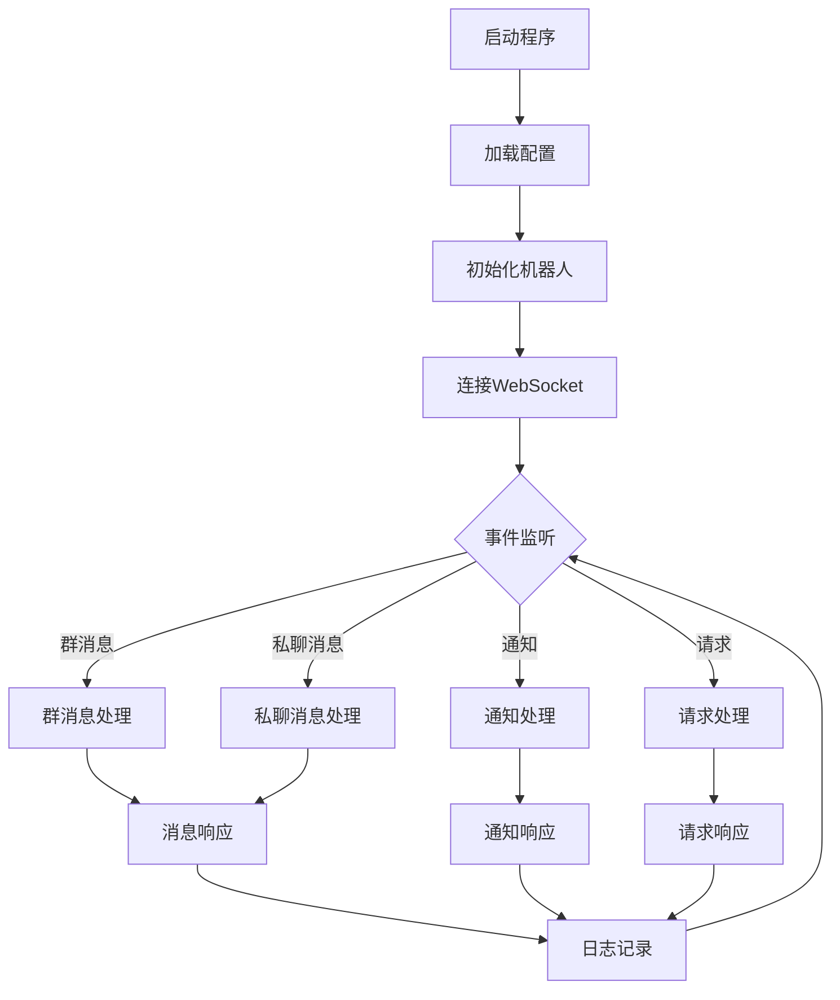

# 🤖 W1ndysBotFrame

## 项目正在重构阶段，可能不稳定！！！

W1ndysBotFrame，一款基于 NapCat 和 Python 开发的机器人程序。

本仓库可能更新不及时，如有需要，请参考 https://github.com/W1ndys/W1ndysBot 的最新更新

## 📁 项目结构

```
app/
├── api/                    # API 接口模块
│   ├── user.py            # 用户相关接口
│   ├── message.py         # 消息处理接口
│   ├── generate.py        # 生成相关接口
│   └── group.py           # 群组管理接口
├── core/                   # 核心功能模块
│   ├── feishu.py          # 飞书集成
│   ├── online_detect.py   # 在线检测
│   └── dingtalk.py        # 钉钉集成
├── scripts/               # 脚本目录
│   └── Example/          # 示例脚本
│       ├── main.py              # 主程序入口
│       ├── data_manager.py      # 数据管理
│       ├── message_handler.py   # 消息处理器
│       ├── group_message_handler.py    # 群消息处理
│       ├── private_message_handler.py  # 私聊消息处理
│       ├── notice_handler.py    # 通知处理器
│       ├── request_handler.py   # 请求处理器
│       ├── response_handler.py  # 响应处理器
│       └── README.md           # 说明文档
├── bot.py                 # 机器人主程序
├── handler_events.py      # 事件处理器
├── main.py               # 程序入口
├── logger.py             # 日志系统
└── config.py             # 配置文件
```

## 🔄 系统流程图



## ✨ 功能说明

- 🔄 群组开关管理：每个群可以单独控制功能的开启/关闭
- 📝 日志系统：支持日志记录和查询
- 💬 钉钉通知：支持发送通知到钉钉
- 🔌 模块化设计：功能模块可以独立开发和管理

## 🛠️ 开发说明

- 新功能开发请参考 `app/scripts/Example` 目录的示例
- 每个功能模块需要包含:
  - `main.py`: 功能实现
  - `README.md`: 功能说明
- 数据存储请在 `app/data` 下创建对应目录

## ⚙️ 配置说明

在 `app/config.py` 中配置:

- `owner_id`: 机器人管理员 QQ 号
- `ws_url`: WebSocket 连接地址
- `token`: 认证 token(可选)
