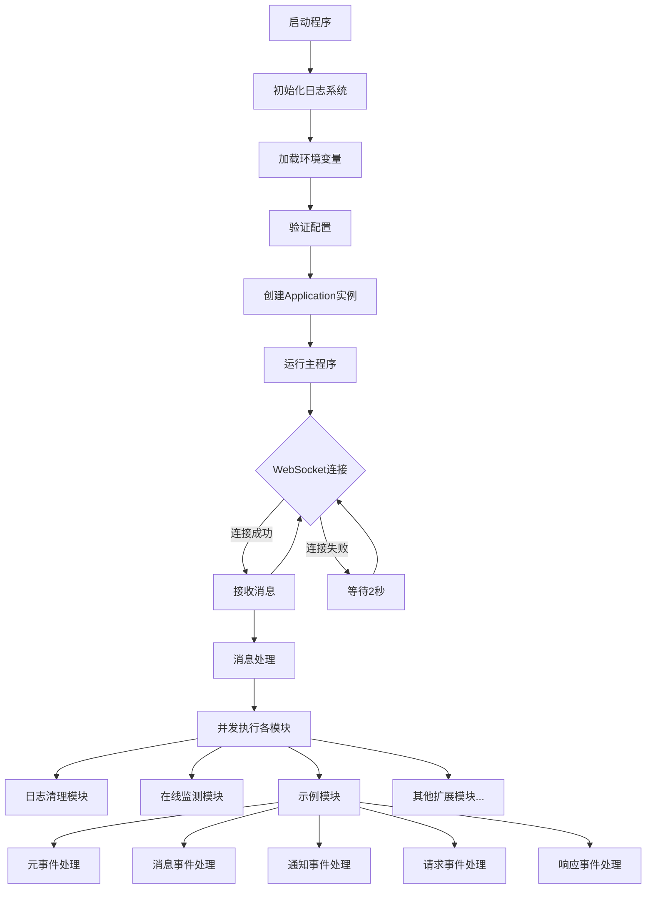
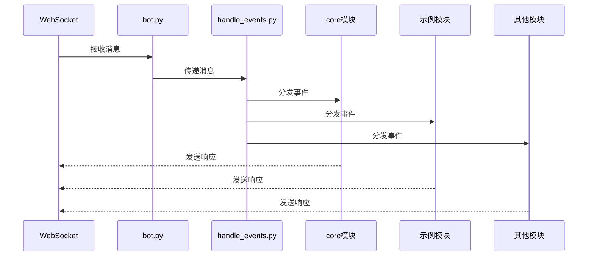
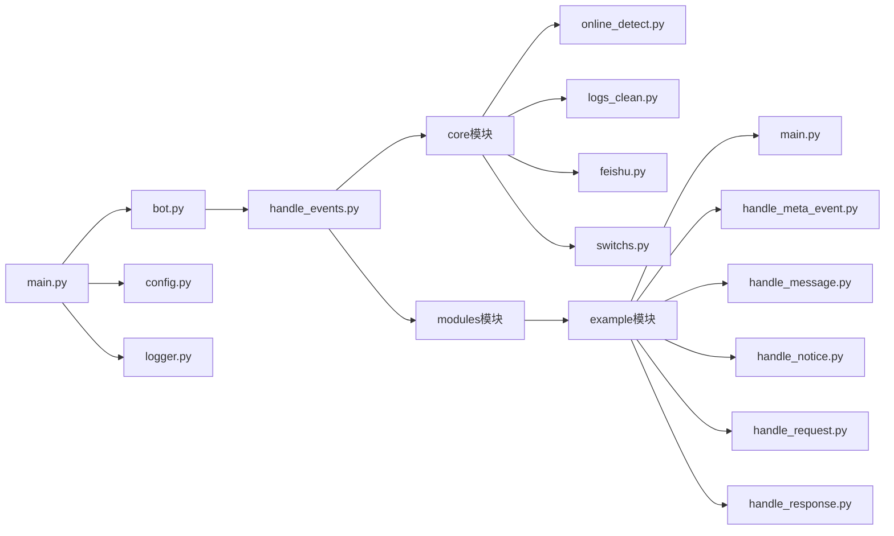

# W1ndysBotFrame 流程图

## 整体架构流程图

## 消息处理流程图

## 模块结构图

## 文字说明

### 程序启动流程

1. **初始化**：
   - 加载.env文件中的环境变量
   - 初始化日志系统
   - 验证配置文件中的必要参数

2. **主程序循环**：
   - 创建Application实例
   - 尝试连接到WebSocket服务器
   - 连接失败时，每2秒重试一次

### 消息处理流程

1. **接收消息**：
   - 通过WebSocket连接接收JSON格式的消息
   - 记录接收到的消息内容

2. **事件分发**：
   - EventHandler类处理接收到的消息
   - 将消息并发分发给各个模块处理器

3. **模块处理**：
   - **核心模块**：
     - 日志清理：定期清理过期日志文件
     - 在线监测：监控机器人在线状态，发送状态变更通知
   - **示例模块**：
     - 根据消息类型分类处理（元事件、消息、通知、请求、响应）
   - **扩展模块**：可以添加更多自定义模块

### 模块架构

1. **核心组件**：
   - `main.py`：应用入口，负责启动和重连逻辑
   - `bot.py`：负责WebSocket连接和消息接收
   - `handle_events.py`：统一的事件处理分发器
   - `config.py`：全局配置参数
   - `logger.py`：日志记录系统

2. **核心模块**：
   - `online_detect.py`：监控机器人在线状态
   - `logs_clean.py`：定期清理日志文件
   - `feishu.py`：飞书机器人通知功能
   - `switchs.py`：功能开关控制

3. **扩展模块**：
   - 模块化设计，可以方便地添加新模块
   - 每个模块独立处理不同类型的事件
   - 模块之间相互独立，不影响其他模块的运行 