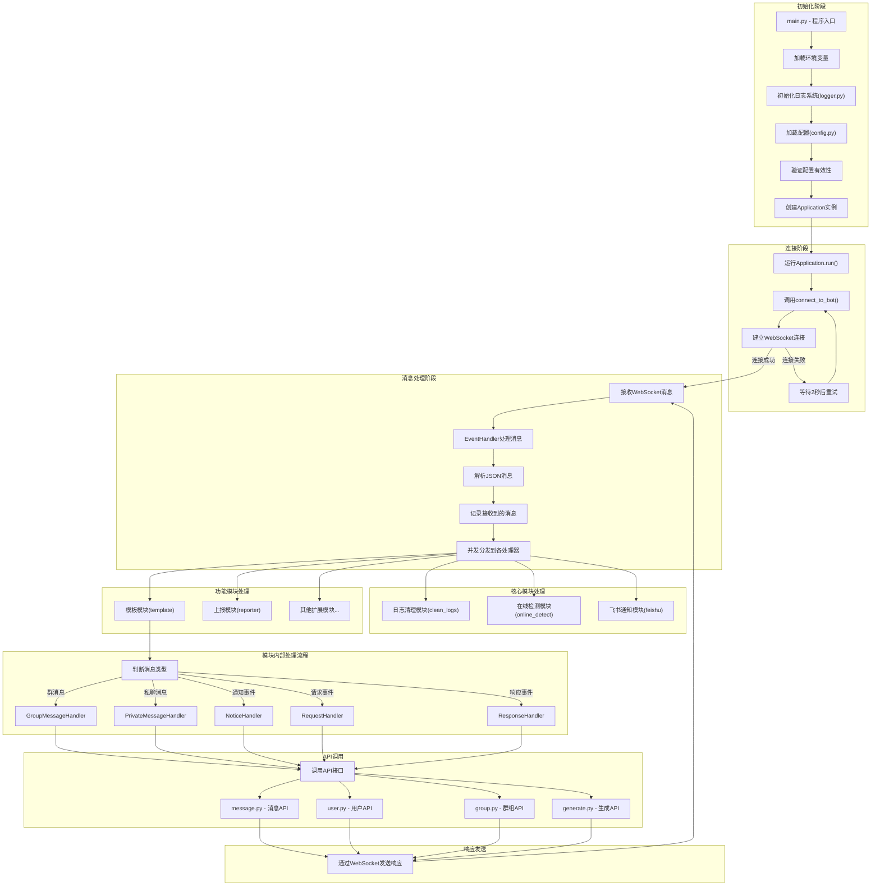

# W1ndysBotFrame 流程图

```mermaid
graph TD
    subgraph "初始化阶段"
        A["main.py - 程序入口"] --> B["加载环境变量"]
        B --> C["初始化日志系统(logger.py)"]
        C --> D["加载配置(config.py)"]
        D --> E["验证配置有效性"]
        E --> F["创建Application实例"]
    end

    subgraph "连接阶段"
        F --> G["运行Application.run()"]
        G --> H["调用connect_to_bot()"]
        H --> I["建立WebSocket连接"]
        I -->|"连接失败"| J["等待2秒后重试"]
        J --> H
    end

    subgraph "消息处理阶段"
        I -->|"连接成功"| K["接收WebSocket消息"]
        K --> L["EventHandler处理消息"]
        L --> M["解析JSON消息"]
        M --> N["记录接收到的消息"]
        N --> O["并发分发到各处理器"]
    end

    subgraph "核心模块处理"
        O --> P1["日志清理模块(clean_logs)"]
        O --> P2["在线检测模块(online_detect)"]
        O --> P3["飞书通知模块(feishu)"]
    end

    subgraph "功能模块处理"
        O --> Q1["模板模块(template)"]
        O --> Q2["上报模块(reporter)"]
        O --> Q3["其他扩展模块..."]
    end

    subgraph "模块内部处理流程"
        Q1 --> R1["判断消息类型"]
        R1 -->|"群消息"| S1["GroupMessageHandler"]
        R1 -->|"私聊消息"| S2["PrivateMessageHandler"]
        R1 -->|"通知事件"| S3["NoticeHandler"]
        R1 -->|"请求事件"| S4["RequestHandler"]
        R1 -->|"响应事件"| S5["ResponseHandler"]
    end

    subgraph "API调用"
        S1 --> T1["调用API接口"]
        S2 --> T1
        S3 --> T1
        S4 --> T1
        S5 --> T1
        T1 --> U1["message.py - 消息API"]
        T1 --> U2["user.py - 用户API"]
        T1 --> U3["group.py - 群组API"]
        T1 --> U4["generate.py - 生成API"]
    end

    subgraph "响应发送"
        U1 --> V["通过WebSocket发送响应"]
        U2 --> V
        U3 --> V
        U4 --> V
        V --> K
    end
```
