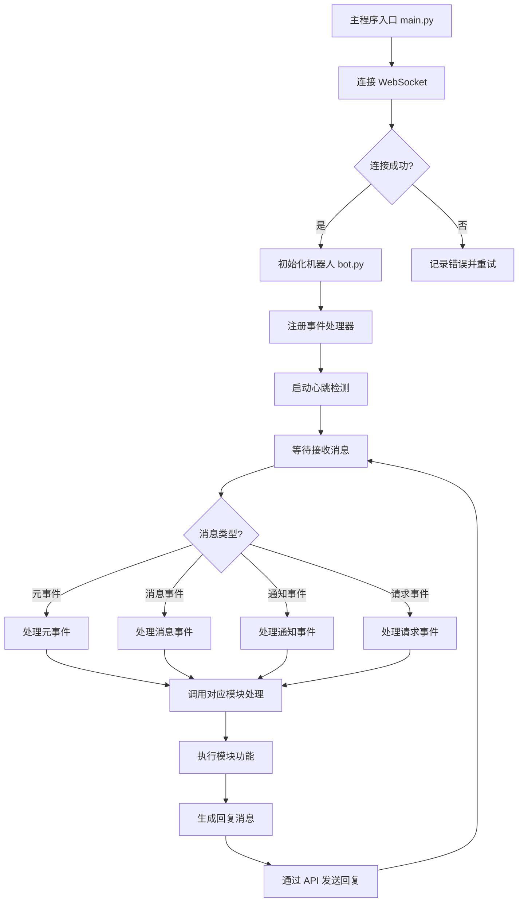
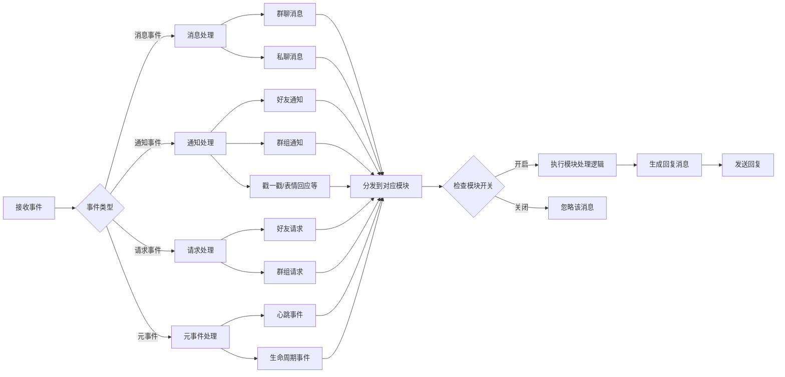
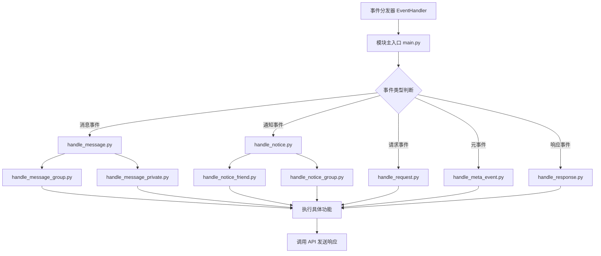
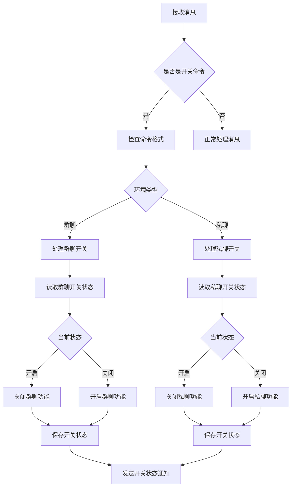
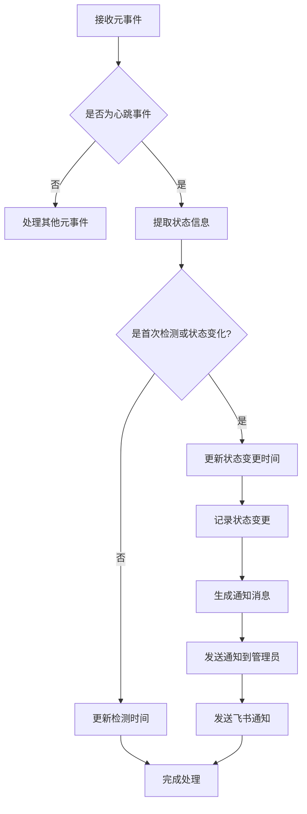
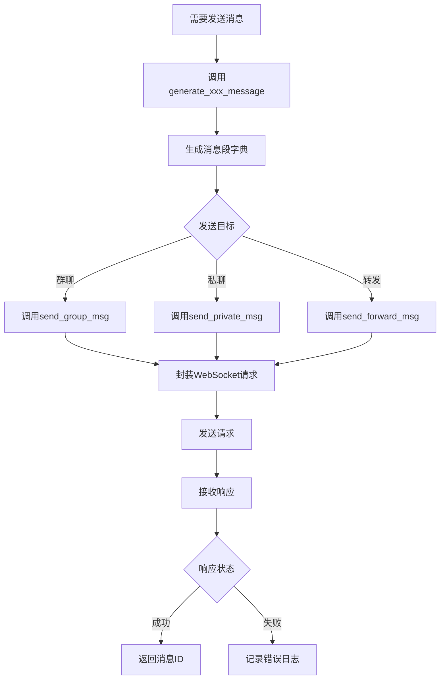

# W1ndysBotFrame 项目流程图

## 整体架构流程图

```mermaid
flowchart TD
    A[主程序入口 main.py] --> B[连接 WebSocket]
    B --> C{连接成功?}
    C -->|是| D[初始化机器人 bot.py]
    C -->|否| E[记录错误并重试]
    D --> F[注册事件处理器]
    F --> G[启动心跳检测]
    G --> H[等待接收消息]
    H --> I{消息类型?}

    I -->|元事件| J[处理元事件]
    I -->|消息事件| K[处理消息事件]
    I -->|通知事件| L[处理通知事件]
    I -->|请求事件| M[处理请求事件]

    J --> N[调用对应模块处理]
    K --> N
    L --> N
    M --> N

    N --> O[执行模块功能]
    O --> P[生成回复消息]
    P --> Q[通过 API 发送回复]
    Q --> H
```

## 事件处理流程

```mermaid
flowchart LR
    A[接收事件] --> B{事件类型}

    B -->|消息事件| C[消息处理]
    C --> C1[群聊消息]
    C --> C2[私聊消息]

    B -->|通知事件| D[通知处理]
    D --> D1[好友通知]
    D --> D2[群组通知]
    D --> D3[戳一戳/表情回应等]

    B -->|请求事件| E[请求处理]
    E --> E1[好友请求]
    E --> E2[群组请求]

    B -->|元事件| F[元事件处理]
    F --> F1[心跳事件]
    F --> F2[生命周期事件]

    C1 & C2 & D1 & D2 & D3 & E1 & E2 & F1 & F2 --> G[分发到对应模块]
    G --> H{检查模块开关}
    H -->|开启| I[执行模块处理逻辑]
    H -->|关闭| J[忽略该消息]

    I --> K[生成回复消息]
    K --> L[发送回复]
```

## 模块系统架构

```mermaid
flowchart TD
    A[事件分发器 EventHandler] --> B[模块主入口 main.py]

    B --> C{事件类型判断}
    C -->|消息事件| D[handle_message.py]
    D --> D1[handle_message_group.py]
    D --> D2[handle_message_private.py]

    C -->|通知事件| E[handle_notice.py]
    E --> E1[handle_notice_friend.py]
    E --> E2[handle_notice_group.py]

    C -->|请求事件| F[handle_request.py]
    C -->|元事件| G[handle_meta_event.py]
    C -->|响应事件| H[handle_response.py]

    D1 & D2 & E1 & E2 & F & G & H --> I[执行具体功能]
    I --> J[调用 API 发送响应]
```

## 模块开关控制流程

```mermaid
flowchart TD
    A[接收消息] --> B{是否是开关命令}
    B -->|是| C[检查命令格式]
    B -->|否| D[正常处理消息]

    C --> E{环境类型}
    E -->|群聊| F[处理群聊开关]
    E -->|私聊| G[处理私聊开关]

    F --> H[读取群聊开关状态]
    H --> I{当前状态}
    I -->|开启| J[关闭群聊功能]
    I -->|关闭| K[开启群聊功能]
    J & K --> L[保存开关状态]

    G --> M[读取私聊开关状态]
    M --> N{当前状态}
    N -->|开启| O[关闭私聊功能]
    N -->|关闭| P[开启私聊功能]
    O & P --> Q[保存开关状态]

    L & Q --> R[发送开关状态通知]
```

## 在线状态检测流程

```mermaid
flowchart TD
    A[接收元事件] --> B{是否为心跳事件}
    B -->|否| C[处理其他元事件]
    B -->|是| D[提取状态信息]

    D --> E{是首次检测或状态变化?}
    E -->|否| F[更新检测时间]
    E -->|是| G[更新状态变更时间]

    G --> H[记录状态变更]
    H --> I[生成通知消息]
    I --> J[发送通知到管理员]
    J --> K[发送飞书通知]

    F & K --> L[完成处理]
```

## API 消息生成与发送流程

```mermaid
flowchart TD
    A[需要发送消息] --> B[调用generate_xxx_message]
    B --> C[生成消息段字典]
    C --> D{发送目标}

    D -->|群聊| E[调用send_group_msg]
    D -->|私聊| F[调用send_private_msg]
    D -->|转发| G[调用send_forward_msg]

    E & F & G --> H[封装WebSocket请求]
    H --> I[发送请求]
    I --> J[接收响应]
    J --> K{响应状态}
    K -->|成功| L[返回消息ID]
    K -->|失败| M[记录错误日志]
```
